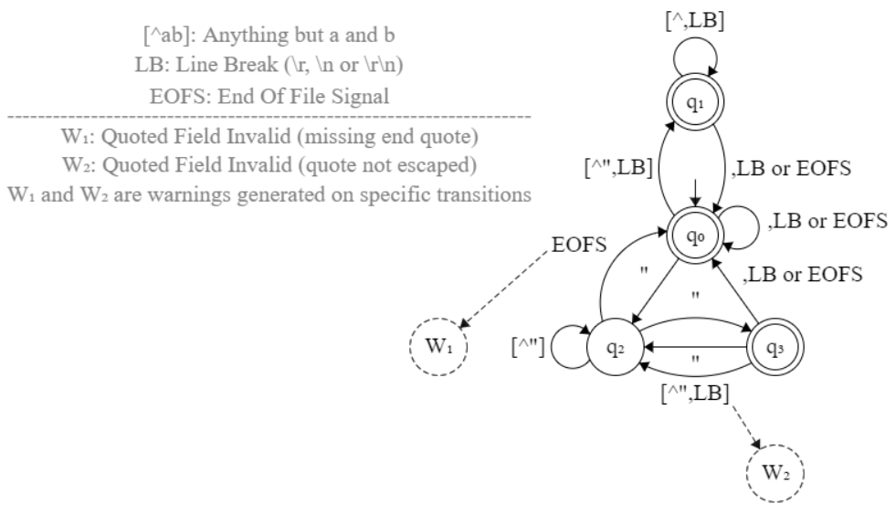

# CSV Parsing for the Developer

- [Introduction](#introduction)
- [RFC 4180](#rfc-4180-to-the-rescue)
- [State machine](#towards-a-finite-state-machine)
- [Implementation](#the-csv-parser-in-javascript)
- [Performance](#benchmarking-and-performance)

## Introduction

This document shares an educational approach to parsing Comma-Separated Values
(CSV), focusing more on reading arbitrary strings than on their source as a
container (e.g. array, file or other data streams). Please note that simply
splitting comma-separated strings on commas would not allow commas to be used
inside fields, as in `a,"b,b",c` which contains three fields instead of four for
example, the second field being enclosed with double quotes. A more elaborate
approach is therefore necessary to increase the flexibility of a CSV parser.

In the following sections, we will create a generic and fast CSV parser in an
easy way, from specification to implementation, testing and performance
benchmarking, while meeting the requirements of a commonly used CSV format
(given that this format is not standardized).

Let's get started!

## RFC 4180 to the rescue

This RFC is said to document the CSV format that seems to be followed by most
CSV parsers, so we will use it for our needs. Every detail is in section 2 of
the RFC: [Definition of the CSV Format](https://datatracker.ietf.org/doc/html/rfc4180#section-2).
Here is our understanding of the seven requirements in the said section of the
RFC, possibly extending those requirements where appropriate.

### Requirements (as interpreted)

#### R1 & R2

Lines in a CSV file are separated by a line break. The last line may or may not
have an ending line break. Each record is located on a separate line and
consists of fields separated by a comma.

- Line breaks are either `\r` (Mac OS), `\n` (Unix systems) or `\r\n` (Windows
OS). So we might implement support for all types of line breaks when parsing.
- The field separator could also be configured and set to any character other
than the comma, mainly `;` (semicolon), `\t` (tabulation) and ` ` (space). Other
characters like `|` (pipe symbol), multiple spaces (instead of a tabulation) or
even a combination of several separators might also be used.

#### R6

Fields containing special characters in the CSV context (i.e. line breaks,
double quotes and commas) must be enclosed in double quotes for those characters
to lose their special meaning. For example, a field separator (e.g. a comma) in
double quotes will not be considered as such.

#### R5 & R7

Each field may or may not be enclosed in double quotes. If a field is not
enclosed with double quotes, then double quotes may or may not appear inside the
field. However, if double quotes are used to enclose a field, then a double
quote appearing inside the field must be escaped by preceding it with another
double quote. At this point, some clarifications are needed before we move on.

- How do we know if a field is being enclosed in double quotes or not?
    - The question is easily answered for fields that do not start with a double
    quote, like `a`, `ab`, `a"` or `a"b"` for example: they are not enclosed
    with double quotes. In other words, such fields are easily distinguished
    when separated by a comma (`a,ab,a",a"b"`).
    - Now let's take a look at `...,"a,bc` where a field starts with a double
    quote. We may advocate that the second comma is a field separator and its
    left side (`"a`) represents a field that is not enclosed with double quotes,
    but we don't actually know if a closing double quote has been forgotten and
    whether the intended field was `"a"` or `"a,bc"` for example, which are
    certainly valid double-quoted fields. For this reason, we will require that
    open double quotes be terminated (`"..."`). In other words, the second comma
    in the previous example is not a field separator, so we are dealing with a
    field enclosed with double quotes but where the closing double quote is
    missing.
- What about escaping a double quote appearing inside a double-quoted field?
Let's start with a few examples: `"a""b"`, `"a""` and `"a"x`.
    - It is easy to realize that the first example is a valid double-quoted
    field representing `a"b` (one double quote escaping the other).
    - The second example is invalid because we need to see the juxtaposed double
    quotes as an escape sequence, so the closing double quote is missing.
    - However, the validity of the last example as a field is open to
    discussion. Indeed, some parsers may reject this field because it contains a
    double quote that is not escaped by another double quote contrary to the
    requirements. Other parsers may accept the field and move one when a comma
    or line break is read, i.e. they will consider the field as not being
    enclosed in double quotes: e.g. they can interpret `"a"x,b` as representing
    two fields (`"a"x` and `b`, or `ax` and `b`). Nevertheless, none of these
    choices were made in LibreOffice 7.1 for example: instead, the field is
    considered enclosed with double quotes but without the closing double quote;
    i.e. `"a"x,b` is an unterminated double-quoted field whose value is `a"x,b`.
    We will do the same for compatibility reasons.

#### R3 & R4

These requirements are quite easy to understand and only apply when parsing CSV
lines as a group (from a file for example). Note however that *spaces are
considered part of a field and should not be ignored*. The use of *should* here
is interesting because (for example) it is debatable whether spaces following a
double-quoted string in a field like `"a"  ` must be ignored or not. Our parser
will not ignore them because the field will be seen as an unterminated
double-quoted field, as mentioned in previous sections.

### Others

There are also Errata for this RFC (see link *Errata exist* at the beginning of
the RFC) referring to [this page](https://www.rfc-editor.org/errata_search.php?rfc=4180&rec_status=0).
No changes recorded there contradict the choices we have made so far. You can
also learn about the status and type of RFC errata [here](https://www.rfc-editor.org/errata-definitions/).

Finally, section 5 of the RFC reminds us of some security considerations. And
while these considerations are addressed in the *MIME Type Registration of text/csv*
section of he RFC (i.e. not in the section 2 of the RFC defining the CSV
format), it's best to keep them in mind, such as the possibility for a malicious
user to exploit a buffer overflow vulnerability due to missing checks in
server-side CSV parsing for example.

## Towards a finite state machine

Now that we have the requirements ready for our CSV parser, let's focus on what
parsing CSV lines might look like regardless of the presence or absence of a
header line. Here is a pseudo-automaton for visualization only. This screenshot
was taken from the [nvc](https://github.com/arlogy/nvc) project user interface,
and JSON data is available below for import. Explanations follow hereinafter.

<p align="center">
    
</p>

```json
{"fsmAlphabet":"","nodes":[{"x":615,"y":269,"text":"q_0","isAcceptState":true,"radius":25,"opacity":1,"dashesEnabled":false,"borderColor":"black","bgColor":"transparent","textColor":"black","readonly.isInitialState":true},{"x":545,"y":367,"text":"q_2","isAcceptState":false,"radius":25,"opacity":1,"dashesEnabled":false,"borderColor":"black","bgColor":"transparent","textColor":"black","readonly.isInitialState":false},{"x":615,"y":152,"text":"q_1","isAcceptState":true,"radius":25,"opacity":1,"dashesEnabled":false,"borderColor":"black","bgColor":"transparent","textColor":"black","readonly.isInitialState":false},{"x":685,"y":367,"text":"q_3","isAcceptState":true,"radius":25,"opacity":1,"dashesEnabled":false,"borderColor":"black","bgColor":"transparent","textColor":"black","readonly.isInitialState":false},{"x":685,"y":478,"text":"W_2","isAcceptState":false,"radius":25,"opacity":1,"dashesEnabled":true,"borderColor":"black","bgColor":"transparent","textColor":"black","readonly.isInitialState":true},{"x":390,"y":367,"text":"W_1","isAcceptState":false,"radius":25,"opacity":1,"dashesEnabled":true,"borderColor":"black","bgColor":"transparent","textColor":"black","readonly.isInitialState":true}],"links":[{"type":"StartLink","nodeIndex":0,"text":"","opacity":1,"dashesEnabled":false,"lineColor":"black","arrowColor":"black","textColor":"black","prefersNodeVisualAttrs":true,"deltaX":0,"deltaY":-49},{"type":"Link","nodeAIndex":0,"nodeAHasArrow":false,"nodeBIndex":1,"nodeBHasArrow":true,"text":"\"","opacity":1,"dashesEnabled":false,"lineColor":"black","arrowColor":"black","textColor":"black","lineAngleAdjust":0,"parallelPart":0.5405405405405405,"perpendicularPart":0},{"type":"Link","nodeAIndex":0,"nodeAHasArrow":false,"nodeBIndex":2,"nodeBHasArrow":true,"text":"[^\",LB]","opacity":1,"dashesEnabled":false,"lineColor":"black","arrowColor":"black","textColor":"black","lineAngleAdjust":3.141592653589793,"parallelPart":0.514792899408284,"perpendicularPart":-32},{"type":"SelfLink","nodeIndex":1,"nodeHasArrow":true,"text":"[^\"]","opacity":1,"dashesEnabled":false,"lineColor":"black","arrowColor":"black","textColor":"black","anchorAngle":3.141592653589793},{"type":"SelfLink","nodeIndex":2,"nodeHasArrow":true,"text":"[^,LB]","opacity":1,"dashesEnabled":false,"lineColor":"black","arrowColor":"black","textColor":"black","anchorAngle":-1.5707963267948966},{"type":"SelfLink","nodeIndex":0,"nodeHasArrow":true,"text":",LB or EOFS","opacity":1,"dashesEnabled":false,"lineColor":"black","arrowColor":"black","textColor":"black","anchorAngle":-0.17662423222323853},{"type":"Link","nodeAIndex":2,"nodeAHasArrow":false,"nodeBIndex":0,"nodeBHasArrow":true,"text":",LB or EOFS","opacity":1,"dashesEnabled":false,"lineColor":"black","arrowColor":"black","textColor":"black","lineAngleAdjust":3.141592653589793,"parallelPart":0.391304347826087,"perpendicularPart":-25},{"type":"Link","nodeAIndex":3,"nodeAHasArrow":false,"nodeBIndex":0,"nodeBHasArrow":true,"text":",LB or EOFS","opacity":1,"dashesEnabled":false,"lineColor":"black","arrowColor":"black","textColor":"black","lineAngleAdjust":0,"parallelPart":0.3339457691453492,"perpendicularPart":0},{"type":"Link","nodeAIndex":1,"nodeAHasArrow":false,"nodeBIndex":3,"nodeBHasArrow":true,"text":"\"","opacity":1,"dashesEnabled":false,"lineColor":"black","arrowColor":"black","textColor":"black","lineAngleAdjust":3.141592653589793,"parallelPart":0.7837837837837838,"perpendicularPart":-18},{"type":"Link","nodeAIndex":3,"nodeAHasArrow":false,"nodeBIndex":1,"nodeBHasArrow":true,"text":"\"","opacity":1,"dashesEnabled":false,"lineColor":"black","arrowColor":"black","textColor":"black","lineAngleAdjust":3.141592653589793,"parallelPart":0.3546099290780142,"perpendicularPart":0},{"type":"Link","nodeAIndex":3,"nodeAHasArrow":false,"nodeBIndex":1,"nodeBHasArrow":true,"text":"[^\",LB]","opacity":1,"dashesEnabled":false,"lineColor":"black","arrowColor":"black","textColor":"black","lineAngleAdjust":3.141592653589793,"parallelPart":0.40425531914893614,"perpendicularPart":-25},{"type":"StartLink","nodeIndex":4,"text":"","opacity":1,"dashesEnabled":false,"lineColor":"black","arrowColor":"black","textColor":"black","prefersNodeVisualAttrs":true,"deltaX":-37,"deltaY":-59},{"type":"Link","nodeAIndex":1,"nodeAHasArrow":false,"nodeBIndex":0,"nodeBHasArrow":true,"text":"EOFS","opacity":1,"dashesEnabled":false,"lineColor":"black","arrowColor":"black","textColor":"black","lineAngleAdjust":3.141592653589793,"parallelPart":0.4488416988416988,"perpendicularPart":-44.75534091637042},{"type":"StartLink","nodeIndex":5,"text":"","opacity":1,"dashesEnabled":false,"lineColor":"black","arrowColor":"black","textColor":"black","prefersNodeVisualAttrs":true,"deltaX":95,"deltaY":-84}],"textItems":[{"x":242,"y":183,"text":"W_1: Quoted Field Invalid (missing end quote)","opacity":1,"textColor":"gray"},{"x":242,"y":208,"text":"W_2: Quoted Field Invalid (quote not escaped)","opacity":1,"textColor":"gray"},{"x":242,"y":148,"text":"EOFS: End Of File Signal","opacity":1,"textColor":"gray"},{"x":242,"y":120,"text":"LB: Line Break (\\r, \\n or \\r\\n)","opacity":1,"textColor":"gray"},{"x":242,"y":94,"text":"[^ab]: Anything but a and b","opacity":1,"textColor":"gray"},{"x":242,"y":164,"text":"---------------------------------------------------------------------","opacity":1,"textColor":"gray"},{"x":242,"y":234,"text":"W_1 and W_2 are warnings generated on specific transitions","opacity":1,"textColor":"gray"}]}
```

First, note that `q0` is the initial state. Given a string, we start from the
initial state, read a character and move to a destination state accordingly. For
example, in `q0`, if we read a comma or a line break, or when we reach the end
of a file, we stay in `q0`, otherwise we transition to `q2` or `q1`. And so on
for each state. However, please note that the pseudo-automaton currently does
not help to understand what we do in each state after reading a character and
before moving to a destination state, but the operations are basically ignoring
or accumulating characters in order to create new fields and new records, a
record being an array of fields on a single line.

Let's get back to reading characters: what happens when there is nothing left to
read? When there is nothing left to read, then it is unsure what to do. Indeed,
we are parsing CSV lines regardless of their container file, so the parser is
unable to detect the end of a file, and that's why we introduced the *End Of File Signal*
(EOFS) in the pseudo-automaton. This signal can be an event to send to the
parser or a function to call on the parser so that it can create a new record
when a line does not end with a line break, such as at the end of a file.

## The CSV parser in JavaScript

- [Documentation and examples](https://github.com/arlogy/jsu/blob/main/doc/jsu_csv_parser.md) |
[Implementation](https://github.com/arlogy/jsu/blob/main/src/jsu_csv_parser.js) |
[Unit tests](https://github.com/arlogy/jsu/blob/main/tests/jsu_csv_parser.js)
- If you are unfamiliar with JavaScript and want to port this implementation to
other programming languages, please read about prototype-based inheritance
first: [Defining a class in JavaScript](https://github.com/arlogy/devnotes/blob/master/web/js_class_definition.md).

## Benchmarking and Performance

### Preparation

Performance benchmarking is based on this [article](https://leanylabs.com/blog/js-csv-parsers-benchmarks/)
which provides a Github repository that we forked [here](https://github.com/arlogy/csv-parsers-benchmarks).
Instead of reading the article, you can only take a look at the Github
repository whose `README.md` file is quite short to read. You will notice that
our CSV parser is part of a library called *jsu*, and we'll use that name to
refer to the parser in this section. Furthermore, we used the version 1.5.0 of
the parser during our benchmarking session: results on execution time may vary
between versions of the parser, but the ranking is the same since version 1.0.0.

Besides, each parser provides different parsing options ([csv-parse](https://csv.js.org/parse/options/),
[csv-parser](https://github.com/mafintosh/csv-parser#csvoptions--headers),
[fast-csv](https://c2fo.github.io/fast-csv/docs/parsing/options/),
[jsu](https://github.com/arlogy/jsu/blob/main/doc/jsu_csv_parser.md#jsucsvpsroptions),
[paparse](https://www.papaparse.com/docs#config)) which were not tested during
benchmarks. So, again, the results might be different when fancy options are
enabled. For example, jsu allows multiple entries for line separators and field
separators; depending on the value of each separator, the regular expression
used internally during parsing is optimized or not, and jsu compares to the
other parsers only when a smart/optimized regular expression is in play, which
is the case for the rather standard delimiters and separators used in CSV files
during benchmarks.

Benchmarking results are as follows.

### Comparison

During benchmarks, we realized that speed variations of a few milliseconds tend
to change between runs, and considering that a speed gain of 250 ms is hardly
noticeable and hardly makes one parser better than the other, we will consider
that two parsers are equivalent in speed if neither finishes more than 250 ms
before the other. For example, if parser `B` terminates up to 250 ms after
parser `A`, parser `B` will not be considered slower and both will have the same
rank (let's say `rk`). Nonetheless, if parser `C` terminates up to 250 ms after
parser `B` but more than 250 ms after parser `A`, then parser `C` cannot have
the same rank as `A` and `B`, so the next rank (`rk+1`) will be used for `C`.
This leads to the following parser classification.

#### All data

Please note that the execution time in parentheses below (both for raw and
quoted data) is expressed in ms, taken from a single benchmarking session and
can change significantly between runs, especially for different hardware
configurations; but the ranking should be fairly stable.

#### Raw data

`raw_c_l` refers to a CSV file not containing double quotes, having `c` columns
and `l` lines. If you prefer, you can focus only on the largest tested file (the
last one reported below).

- `raw_10_10000`: 1. String.split (14.75) / 1. papaparse (24.2) / 1. jsu-smart-on (37.85) / 1. dekkai (42.85) / 1. csv-parser (70.1) / 1. csv-parse (77.7) / 1. jsu-smart-off (144.6) / 1. fast-csv (148.25)
- `raw_10_10000`: 1. String.split (115.1) / 1. papaparse (139.5) / 1. jsu-smart-on (279.6) / 1. dekkai (291) / 2. csv-parser (583) / 2. csv-parse (657.5) / 3. fast-csv (1195.1) / 3. jsu-smart-off (1329.4)
- `raw_10_100000`:  1. String.split (181) / 1. papaparse (233.2) / 1. jsu-smart-on (358.4) / 2. csv-parser (729.8) / 2. csv-parse (785) / 3. fast-csv (1466.2) / 3. jsu-smart-off (1541.6)
- `raw_100_100000`: 1. String.split (1180.6) / 2. papaparse (1639.2) / 3. jsu-smart-on (3122.4) / 4. csv-parser (5959.8) / 5. csv-parse (6841.6) / 6. fast-csv (13430.2) / 7. jsu-smart-off (14279)

dekkai crashed in the last two tests, so no results are available. And even
though String.split performs better than any other parser, please note that it
can split a string incorrectly as shown [here](https://stackoverflow.com/questions/30912663/sort-a-string-alphabetically-using-a-function/58220344#58220344).
Therefore and considering only the last result, papaparse is number one,
followed by jsu which finished less than 2 seconds behind, then comes csv-parser
which finished less than 3 seconds after jsu. Any other parser becomes
impractical in terms of speed at this point, although csv-parse isn't that far
off.

#### Quoted data

`quotes_c_l` refers to a CSV file containing double quotes, having `c` columns
and `l` lines. If you prefer, you can focus only on the largest tested file (the
last one reported below).

- `quotes_10_10000`: 1. dekkai (44.2) / 1. papaparse (47.05) / 1. jsu-smart-on (54.75) / 1. csv-parser (73.15) / 1. csv-parse (79.35) / 1. jsu-smart-off (135.65) / 1. fast-csv (174.9)
- `quotes_100_10000`: 1. dekkai (292.9) / 1. papaparse (358.6) / 1. jsu-smart-on (491.6) / 2. csv-parser (649.9) / 2. csv-parse (679.3) / 3. jsu-smart-off (1239.2) / 3. fast-csv (1444.7)
- `quotes_10_100000`: 1. papaparse (419.4) / 1. jsu-smart-on (521.6) / 2. csv-parse (809.4) / 2. csv-parser (825.6) / 3. jsu-smart-off (1407) / 4. fast-csv (1721.4)
- `quotes_100_100000`: 1. papaparse (4021.6) / 2. jsu-smart-on (5234.6) / 3. csv-parser (6799.8) / 4. csv-parse (7193) / 5. jsu-smart-off (13691.6) / 6. fast-csv (15773.4)

Again, dekkai crashed in the last two tests, so no results are available.
String.split is not applicable here because additional code is needed to
correctly parse quoted fields. Therefore and considering only the last result,
papaparse is still Papa (the fastest), followed by jsu which finished about 1
second behind, then comes csv-parser and csv-parse which are about 2 seconds
behind jsu. The other parsers are less interesting in terms of speed at this
stage.

#### Fun facts

What's surprising is how fast the fast-csv parser is... If the problem is not in
our benchmarks, it may be interesting to read their source code to understand
the reason of the slowness. Also note that some parsers may be using Node.js
threads to speed up parsing: jsu doesn't use any. It's also not certain that all
parsers are RFC 4180 compliant, but papaparse and jsu surely are.
